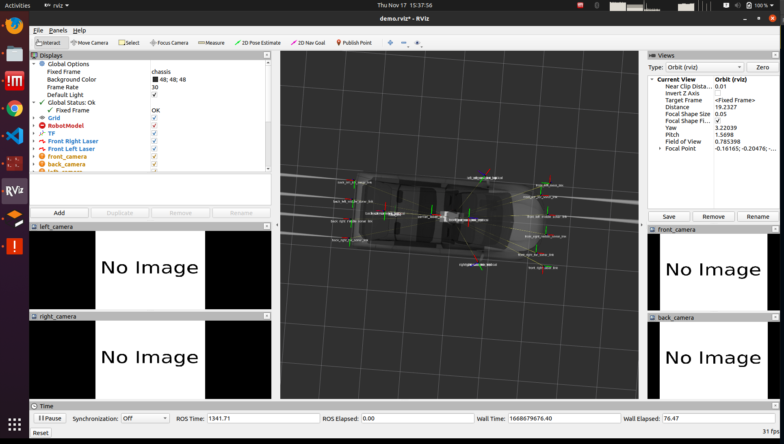
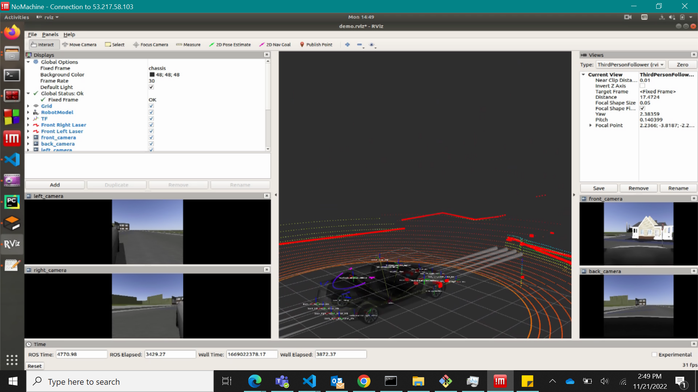
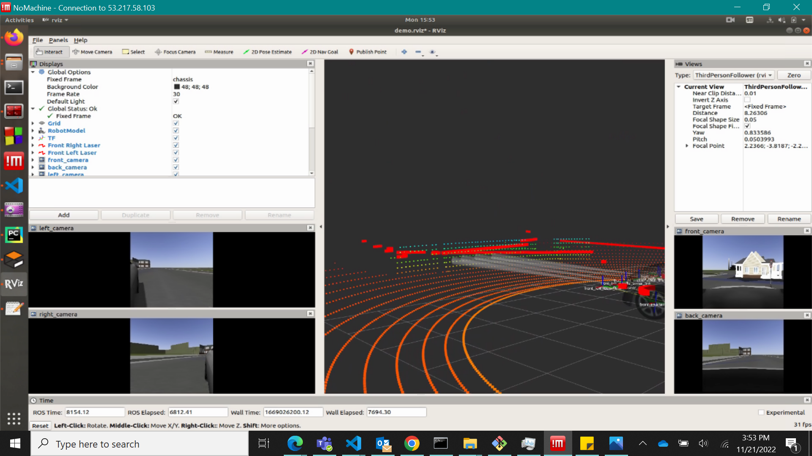

Gazebo simulator with a Benz car

- S CLASS in progress .

## Main repositories for reference

- <https://github.com/TixiaoShan/jackal_velodyne>
- <https://github.com/hdh7485/ackermann_vehicle>
- <https://github.com/chrissunny94/ackerman_ros_robot_gazebo_simulation>

## Aim of this project

Aim of this collaborative project is to create the simulation of the test cases in the Gazebo using the 2D ROS to simulate the various 3D test cases in the virtual environment. The usefulness of this project is that it will help better understand the surrounding of the vehicle in Real-time, to understand the used cases. It will also help in the offline callibiration to the vehicle
-

## Steps to build

```

```

## Steps to run

```
roslaunch jackal_velodyne gmapping_demo.launch
```

```
roslaunch car_demo demo.launch

```


--------------------------------------------------------------------------------------------------------


### heres the top view of the vehicle in the rviz, the vehicle has 4 sonar links at the rear and at the front which is connected to a centralised system





### In this image the circuit of the included sensors and their scope can be seen considering the radar is being used as a centralised link to all the ultrasound sensors which are present at the rear and at the front of the vehicle. Here the radar is being used by synchronizing it with the ultrasound sensors to get better lateral ranging starting from the lower center part of the vehicle, which is being denoted by the spehrical circle of the dots arround the vehicle. One of the aim of this sync is to help in detecting the faulty roadways, so that vehicle can intelligently detect and avoid the faulty pathways.



### The combined system of the ultrasonic sensors provide the scope of the detection for the fully automated park assist, which could still be considered as a test phase. In the below image, the scope detected the obstacle i.e. a house in front of the vehicle. The real time simulated images by the combined system could be seen at the lower corner of the image.



### here is a sample on how to set up the gazebo simulation

<iframe src="https://corpdir-my.sharepoint.com/personal/cthalia_apac_corpdir_net/_layouts/15/embed.aspx?UniqueId=e74b963f-e592-4ea1-91a8-6dff79f56823&nav=%7B%22playbackOptions%22%3A%7B%22startTimeInSeconds%22%3A0%7D%7D&embed=%7B%22af%22%3Atrue%2C%22ust%22%3Atrue%7D&referrer=StreamWebApp&referrerScenario=EmbedDialog.Create" width="640" height="360" frameborder="0" scrolling="no" allowfullscreen title="gazebo_kumar.mp4"></iframe>


##  git commands

```
 git add .
 git commit -a
 git push   
```


## Useful links

- https://answers.ros.org/question/140881/how-can-i-convert-pointcloud2-to-pointcloud/
- 
