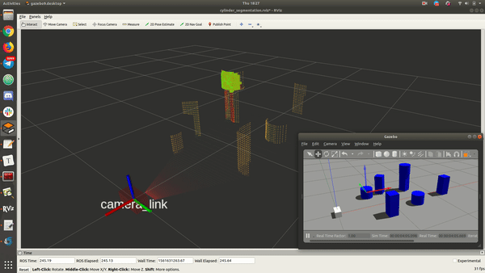

# pcl-ros-tutorial
---




[Image Source](<http://pointclouds.org/>)

> The **Point Cloud Library** (or **PCL**) is a **large scale, open project [1]** for 2D/3D image and point cloud processing. The PCL framework contains numerous state-of-the art algorithms including filtering, feature estimation, surface reconstruction, registration, model fitting and segmentation. These algorithms can be used, for example, to filter outliers from noisy data, stitch 3D point clouds together, segment relevant parts of a scene, extract keypoints and compute descriptors to recognize objects in the world based on their geometric appearance, and create surfaces from point clouds and visualize them -- to name a few.
>
> PCL is released under the terms of the [3-clause BSD license](http://en.wikipedia.org/wiki/BSD_licenses#3-clause_license_.28.22New_BSD_License.22_or_.22Modified_BSD_License.22.29) and is open source software. **It is free for commercial and research use.**
>
> PCL is **cross-platform**, and has been successfully compiled and deployed on Linux, MacOS, Windows, and [Android/iOS](http://pointclouds.org/news/2012/05/29/pcl-goes-mobile-with-ves-and-kiwi/). To simplify development, PCL is split into a series of smaller code libraries, that can be compiled separately. This modularity is important for distributing PCL on platforms with reduced computational or size constraints (for more information about each module see the [documentation](http://pointclouds.org/documentation/) page).
>
> <http://pointclouds.org/about/>


### Introduction

A fairly in-depth tutorial for the Point Cloud Library (with ROS integration notes!)

There's a lot of jumbled up tutorials everywhere for PCL and ROS (some of which are a bit outdated because PCL split from ROS to become its own independent library.) So here's an attempt to put together a fairly comprehensive tutorial for ROS and PCL for a beginner!

This should be enough to get started and have a fair grounding in PCL before jumping into the [full component based tutorials offered by the PCL foundation](<http://pointclouds.org/documentation/tutorials/>)!


### Pre-Requisite Knowledge:

- Make sure you're caught up on [ROS](<https://github.com/methylDragon/coding-notes/tree/master/Robot Operating System (ROS)/ROS>) and [C++](<https://github.com/methylDragon/coding-notes/tree/master/C++>)
- And, if you need ROS, you definitely need [Linux](<https://github.com/methylDragon/linux-reference>)


```
                            .     .
                         .  |\-^-/|  .    
                        /| } O.=.O { |\
```

​    

------

[.png)](https://www.buymeacoffee.com/methylDragon)
